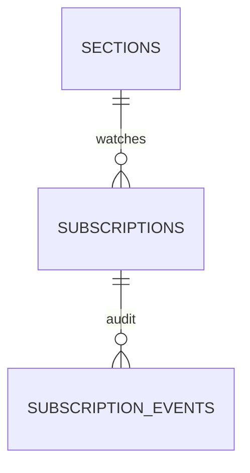

# Subscription Data Model & API Contract

## Scope and goals
- Define the contract between the UI, API layer, and SQLite schema when a user requests seat opening notifications.
- Ensure downstream tasks (`subscriptions` write path, notification worker, UI subscribe modal) share one source of truth for fields, constraints, and lifecycle semantics.
- Call out validation, rate limits, and dedup strategies so the implementation can stay cheap to operate while being resilient against spam or duplicate submissions.

## Entities overview


- `sections` is already defined in `docs/local_data_model.md` and provides `section_id`, `term_id`, `campus_code`, and `index_number`.
- `subscriptions` holds the user request plus normalized contact and preference data.
- `subscription_events` is the append-only audit log for status transitions, notification attempts, and errors.

## `subscriptions` table

| Column | Type | Example | Notes |
| --- | --- | --- | --- |
| `subscription_id` (PK) | INTEGER | `8231` | Auto-increment surrogate key surfaced back to clients. |
| `section_id` (FK) | INTEGER | `512345` | References `sections.section_id`. Nullable when the section has been purged yet the subscription still exists; the denormalized keys keep it alive. |
| `term_id` | TEXT | `20241` | Copied from the section to avoid joins when looking up by term + index. |
| `campus_code` | TEXT | `NB` | Mirrors `sections.campus_code`. |
| `index_number` | TEXT | `12345` | Section index users enter in the UI; required to be unique per term/campus via `sections` table. |
| `contact_type` | TEXT | `email` | Always `email` in local mode; kept for schema compatibility. |
| `contact_value` | TEXT | `student@example.edu` | Raw user input after trimming; only stored in clear text when unavoidable (email). |
| `contact_hash` | TEXT | `sha1(student@example.edu)` | Always lower-cased SHA1 of `contact_value`. Enables uniqueness + per-contact rate limiting without storing redundant PII. |
| `locale` | TEXT | `en-US` | Used by email templates. Defaults to deployment locale when omitted. |
| `status` | TEXT | `active` | Enumerated values described below (`active`, `unsubscribed`, with other states reserved). |
| `is_verified` | INTEGER | `0` or `1` | Always `1` on insert; subscriptions activate immediately. |
| `created_at` | TEXT | ISO string | UTC timestamp generated by the API server. |
| `updated_at` | TEXT | ISO string | UTC timestamp touched on every status/pref change. |
| `last_notified_at` | TEXT | ISO string | Tracks throttling between sends and enforces `maxNotifications`. |
| `last_known_section_status` | TEXT | `Closed` | Snapshot of the last section `open_status` processed for this subscription to avoid duplicate sends. |
| `unsubscribe_token` | TEXT | `b0d4...` | 32+ char random token hashed into links and the `/api/unsubscribe` payload. |
| `metadata` | TEXT (JSON) | `{...}` | JSON blob that currently holds the preference object. |

### Preferences payload (`metadata.preferences`)

| Field | Type | Default | Notes |
| --- | --- | --- | --- |
| `notifyOn` | Array&lt;`"open"` \| `"waitlist"`&gt; | `["open"]` | Controls which section states should trigger notifications. `"waitlist"` is optional for courses that expose waitlist-only openings. |
| `maxNotifications` | Integer | `3` | Hard cap of sends per enrollment window. Once reached the subscription auto-transitions to `paused`. |
| `deliveryWindow` | `{ startMinutes: number, endMinutes: number }` | `0-1440` | Optional quiet hours in minutes after midnight (local campus time). Notifications outside the window land in `pending_send` queue until the window re-opens. |
| `snoozeUntil` | ISO timestamp | `null` | When set the status flips to `paused` until the timestamp expires. |
| `channelMetadata` | Object | `{}` | Reserved for future channel-specific options; ignored today. |

`metadata` is limited to the preferences payload in local mode. Future fields must be **appended**, never removed, to keep migrations additive.

### Indexes and constraints
- `idx_subscriptions_active_unique` (partial unique) on `(section_id, contact_hash, contact_type)` when `status IN ('pending','active')` blocks duplicate requests for the same section/contact pair.
- `idx_subscriptions_active` on `(section_id, status)` is used by the notification worker to fetch candidates who still need alerts.
- `contact_hash` is always derived by `sha1(lower(trim(contact_value)))`. Clients never set it directly.
- When `section_id` is absent the API enforces uniqueness via `(term_id, campus_code, index_number, contact_hash, contact_type)` in application code so retries reuse the existing unresolved row.
- `section_id` can be resolved lazily: the API fills it when a section exists and defers to `term_id + index_number` otherwise so we can still clean up when the section reappears.

## `subscription_events` table

| Column | Type | Notes |
| --- | --- | --- |
| `event_id` (PK) | INTEGER | Auto-increment. |
| `subscription_id` | INTEGER | FK to `subscriptions`. |
| `event_type` | TEXT | Enum listed below. |
| `section_status_snapshot` | TEXT | Stores the section `open_status` or derived state at the moment the event fired. |
| `payload` | TEXT (JSON) | Channel-specific metadata (email message id, validation reasons, etc.). |
| `created_at` | TEXT | UTC timestamp. |

### Event types
`event_type` is a constrained string with the following canonical values:

| Type | Producer | Description |
| --- | --- | --- |
| `created` | `/api/subscribe` | Fresh row inserted (`status=active`). |
| `unsubscribed` | `/api/unsubscribe` | User-initiated cancellation. |

Other event types from earlier server builds are reserved but not emitted in local mode.

## Status model and transitions

Local mode keeps the lifecycle simple:
- `active` &rarr; set on creation; eligible for notifications.
- `unsubscribed` &rarr; terminal when the user cancels.

Fields for `pending`, `paused`, and `suppressed` remain in the schema for compatibility but are not used today. Creation and unsubscribe events are recorded in `subscription_events` for auditability.

## API contracts

### `POST /api/subscribe`
Creates or reuses a subscription for the provided section/index.

**Request body**

| Field | Type | Required | Notes |
| --- | --- | --- | --- |
| `term` | string | Yes | Matches `term_id`. Helps disambiguate when the same index appears in multiple terms. |
| `campus` | string | Yes | `NB`, `NK`, `CM`, etc. |
| `sectionIndex` | string | Yes | Numeric index the user sees in SOC. |
| `contactType` | `"email"` | Yes | Fixed to `email` in local mode. |
| `contactValue` | string | Yes | Email address. Trimmed before hashing/storing. |
| `locale` | string |  | Defaults to deployment locale; determines template language. |
| `preferences` | object |  | Partial object that overrides `metadata.preferences`. Missing fields fall back to defaults defined above. |

- The API looks up the `sections` row by `(term, campus, sectionIndex)`. When missing (e.g., data lag or removed section) the API still accepts the request, stores the denormalized `term/campus/index` with `section_id = null`, and flags the response with `sectionResolved: false`. Only malformed `term`/`campus` combinations return `404 section_not_found`.
- `contact_hash` is computed server-side; the unique partial index guarantees idempotency. When a matching `pending/active` record exists the endpoint returns `200` with `existing: true` and never inserts a duplicate.
- New rows start `active`; no verification or per-IP throttling runs in local mode.
- The response emits a `traceId` header + field so UI logs can correlate with backend traces.

**Response shape**

| Field | Type | Notes |
| --- | --- | --- |
| `subscriptionId` | number | Present for both new and reused subscriptions. |
| `status` | string | Current lifecycle status (`active` on creation). |
| `requiresVerification` | boolean | Always `false` in local mode. |
| `existing` | boolean | `true` when the request hit the unique constraint and returned the prior row. |
| `unsubscribeToken` | string | Token for unsubscribe flows. |
| `term`, `campus`, `sectionIndex` | string | Echo back resolved routing data. |
| `sectionResolved` | boolean | `false` when `section_id` could not be attached yet; clients may show a warning but no retry is needed. |
| `preferences` | object | Effective preference set after merging defaults and payload overrides. |
| `traceId` | string | Mirrors `X-Trace-Id` header. |

**Example**

```json
POST /api/subscribe
{
  "term": "20241",
  "campus": "NB",
  "sectionIndex": "12345",
  "contactType": "email",
  "contactValue": "student@example.edu",
  "locale": "en-US",
  "preferences": {
    "notifyOn": ["open", "waitlist"],
    "maxNotifications": 5
  }
}

201 Created
{
  "subscriptionId": 8231,
  "status": "active",
  "requiresVerification": false,
  "existing": false,
  "unsubscribeToken": "b0d4c5ab88974b0ea4ddf0ee1f6f6d7b",
  "term": "20241",
  "campus": "NB",
  "sectionIndex": "12345",
  "sectionResolved": true,
  "preferences": {
    "notifyOn": ["open", "waitlist"],
    "maxNotifications": 5,
    "deliveryWindow": { "startMinutes": 0, "endMinutes": 1440 },
    "snoozeUntil": null,
    "channelMetadata": {}
  },
  "traceId": "c95feef9b7a54e03"
}
```

**Error codes**
- `400` `invalid_contact` &rarr; malformed email, unsupported locale, or missing fields.
- `404` `section_not_found` &rarr; the provided `term` or `campus` is unknown/disabled for this deployment. When the term/campus is valid but the specific `sectionIndex` is missing in the DB, the API still returns `200` with `sectionResolved: false`.
- `409` `section_conflict` &rarr; the section exists in a different term/campus than the payload; the response includes the canonical term/campus to guide UI fixes.

### `POST /api/unsubscribe`
Cancels a subscription using either the numeric ID (signed user flows) or the opaque token (email link flows).

**Request body**

| Field | Type | Required | Notes |
| --- | --- | --- | --- |
| `subscriptionId` | number | Yes\* | Provide when unsubscribing from the UI. |
| `unsubscribeToken` | string | Yes\* | Provide when unsubscribing from email links. At least one of `subscriptionId` or `unsubscribeToken` must be present. |
| `contactValue` | string |  | Optional secondary check for UI flows. |
| `reason` | string |  | Optional telemetry, e.g., `user_request`, `too_many_emails`. |

**Behavior**
- Looks up the row by `(subscription_id)` when provided; otherwise matches `unsubscribe_token`.
- If the row is already `unsubscribed` the endpoint responds with `200` and `previousStatus: "unsubscribed"` (idempotent).
- When the row is `active`, the API flips `status` to `unsubscribed`, clears `is_verified`, writes an `unsubscribed` event, and obfuscates the `contact_value` to reduce retained PII.
- Unknown tokens return `404` `subscription_not_found` without revealing whether the token ever existed.

**Response shape**

| Field | Type | Notes |
| --- | --- | --- |
| `subscriptionId` | number | Echoed when known. |
| `status` | `"unsubscribed"` | Always the terminal status after this call. |
| `previousStatus` | string | Helps the UI show "You were already unsubscribed" vs "Success" copy. |
| `traceId` | string | For logging. |

**Example**

```json
POST /api/unsubscribe
{
  "unsubscribeToken": "b0d4c5ab88974b0ea4ddf0ee1f6f6d7b",
  "reason": "user_request"
}

200 OK
{
  "subscriptionId": 8231,
  "status": "unsubscribed",
  "previousStatus": "active",
  "traceId": "d012fe48bf39408c"
}
```

## Validation, rate limits, and safety policies
- **Contact validation**: Email addresses must pass an RFC 5322-light regex, strip display names, and lowercase the domain. Disposable-domain rejection is optional; no Discord IDs are accepted in local mode.
- **Rate limits**: No per-IP or per-contact throttles are enforced in local mode.
- **Deduplication**: The partial unique index + `contact_hash` ensures the API is idempotent. When duplicates occur the server returns the existing record and surfaced status so the UI can show "You are already subscribed" copy.
- **Verification**: No verification step runs; subscriptions enter `active` immediately.
- **Quiet hours**: Subscriptions with `deliveryWindow` outside of 24/7 operate via the worker honoring `startMinutes/endMinutes`, storing deferrals in `metadata` so reboots survive.
- **Auditing and compliance**: Creation and unsubscribe calls spawn `subscription_events` rows. `unsubscribe_token` values are random 128-bit hex strings stored in clear text so that links stay deterministic; loggers must redact them.
- **PII handling**: `contact_value` is stored for email so reminders can be delivered. When a subscription hits `unsubscribed`, the implementation blanks `contact_value` while retaining the hash for dedup.

This document is the reference for `ST-20251113-act-009-02-subscribe-endpoints` and later notification worker tasks--any schema or contract change must be reflected here first.
